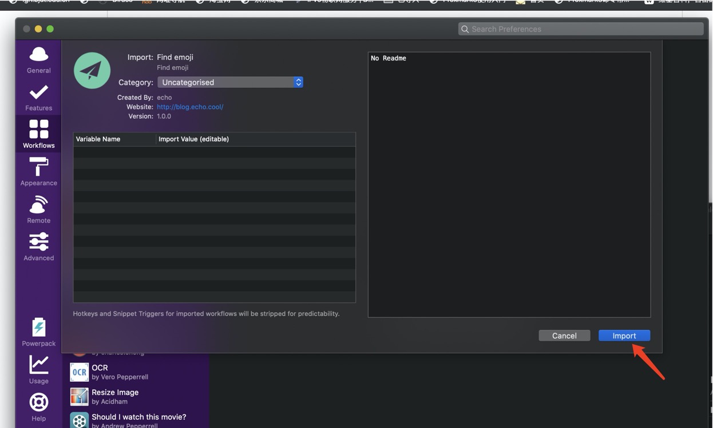

# Alfred-Find-emoji
  
 
 
## 预览

## Features

+ 启动`Alfred`，输入`em`启动该 workflow。
+ 使用方法 `em {query}`
+ 一键调出搜索页面, 需要先在Alfred Workflow中设置热键
+ 按`Enter`键复制表情图标

## Dependencies

python2.7

## 安装

[下载地址1](https://github.com/echo-cool/Alfred3-Find-emoji/raw/master/Find-emoji.alfredworkflow) 

[下载地址2](http://photos-picgo.oss-cn-beijing.aliyuncs.com/Find-emoji.alfredworkflow)

下载完成后，点击下载的文件，之后点击导入即可

之后帮我点个star呗～🤝🤝

## TODO

+ 优化查询速度
+ 界面美化

## CHANGELOG
#### 1.0

+ 完成emoji搜索功能
